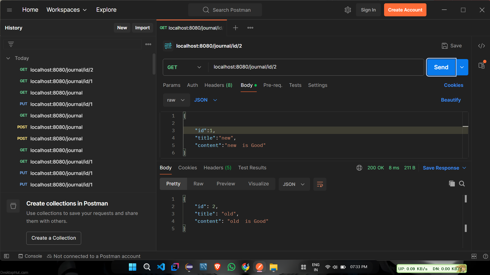
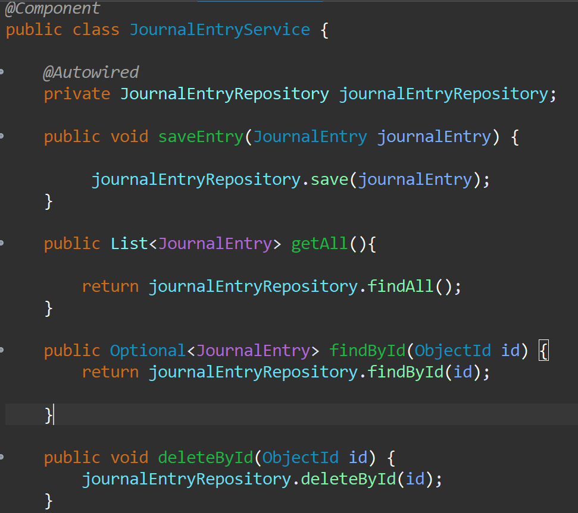
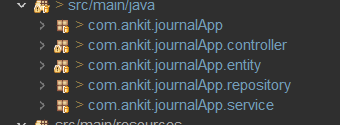

# 🚀 Spring Boot Revision Repository

This repository contains my **Spring Boot learning and practice projects** including REST APIs, CRUD operations, and backend development concepts.

---

## 🛠 Technologies Used

- Java 
- Spring Boot
- Spring Data JPA
- Hibernate
- Maven
- REST APIs
- Postman (API Testing)

---

## 📂 Projects

### 1️⃣ FirstProject
Basic Spring Boot application to understand project structure and configuration.

### 2️⃣ Journal App
A REST API project for managing journal entries.

Features:
- Create journal entry
- View all entries
- Update entry
- Delete entry

---

## 📸 API Testing (Postman)

Example response from the Journal API.

### ✅ Added Methods in Service Layer

The following methods were added to improve functionality and structure in the Service layer.

### 📂 Updated Folder Structure

The project folder structure has been improved for better organization and scalability.

---

## 🧠 What I Learned

- Creating REST APIs with Spring Boot
- Layered architecture (Controller → Service → Repository)
- CRUD operations
- Using Maven for dependency management
- Testing APIs with Postman

---

## 👨‍💻 Author

**Omkar Thorat**

Java Full Stack Developer  
Spring Boot | Java | SQL
